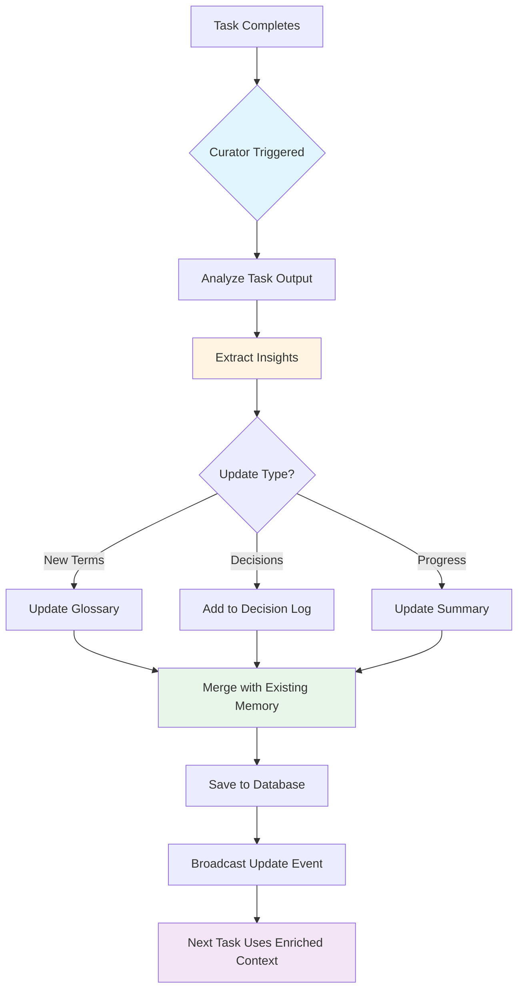

# HighFlow

> AI-powered workflow orchestration platform with intelligent task automation and multi-agent collaboration.

[](https://www.gnu.org/licenses/agpl-3.0)
[](https://www.typescriptlang.org/)
[](https://vuejs.org/)
[](https://www.electronjs.org/)

## 🌟 Overview

HighFlow is a next-generation workflow manager that orchestrates complex tasks using multiple AI agents. It combines traditional project management tools (Kanban, DAG visualization) with an intelligent execution engine capable of automating tasks, generating content, and interacting with your local development environment.

**Key Capabilities:**

- 🤖 **Multi-AI Support**: Integrate OpenAI, Anthropic, Google, Groq, Mistral, and local models
- 🔗 **MCP Integration**: AI agents access external tools via Model Context Protocol servers
- 🎯 **Smart Operators**: Reusable AI personas with specialized skills
- 📊 **Visual Workflows**: Design complex task dependencies with DAG editor
- 🏠 **Local-First**: Offline SQLite database with optional cloud sync

---

## 🚀 Quick Start

### Prerequisites

- Node.js 22+
- pnpm

### Installation

```bash
# Clone repository
git clone https://github.com/HighGarden-Studio/HighFlow.git
cd HighFlow

# Install dependencies
pnpm install

# Setup environment
cp .env.example .env

# Run development mode
pnpm dev:electron
```

### First Steps

1. **Configure AI Provider**: Settings → AI Providers → Add your API key
2. **Create Project**: Home → New Project → Project Wizard or start blank
3. **Add Tasks**: Kanban view → Create AI/Script/Input/Output tasks
4. **Execute**: Click "Run" on any task to start execution

---

## 1. Global Configuration

Global settings apply across all projects and serve as fallback defaults when project or task-level settings are not specified.

### 1.1 AI Providers

HighFlow integrates with major AI providers. Configure them in **Settings → AI Providers**.

#### ✅ Currently Supported

| Provider             | Models                           | Features                       |
| -------------------- | -------------------------------- | ------------------------------ |
| **OpenAI**           | gpt-4o, gpt-4o-mini, o1, o1-mini | Chat, Code, Vision, TTS, STT   |
| **Anthropic**        | Claude 3.5 Sonnet, Opus, Haiku   | Long context, Vision, Tool use |
| **Google AI**        | Gemini 2.0 Pro/Flash, Gemini 1.5 | Multi-modal, Extended context  |
| **Groq**             | Llama 3.3, Mixtral               | Ultra-fast inference           |
| **Mistral AI**       | Large, Medium, Small             | European AI, Code-optimized    |
| **LM Studio**        | Local models                     | Privacy-first, Offline         |
| **HighFlow Default** | Cloud credits                    | No API key required            |

#### 🏠 Local Models

Run models on your machine using **LM Studio**:

- **LM Studio**: Any GGUF model with OpenAI-compatible API
- Supports Llama, Mistral, Gemma, Qwen, and other open models
- Complete offline execution
- No API costs

#### Configuration

**API Key Method:**

1. Settings → AI Providers → Select provider
2. Enter API key
3. Test connection
4. Save

**OAuth Method (Google):**

1. Settings → AI Providers → Google AI
2. Click "Connect with OAuth"
3. Authorize in browser
4. Return to app

### 1.2 MCP Servers

**Model Context Protocol (MCP)** enables AI agents to securely interact with external systems.

#### What is MCP?

MCP is an open protocol that allows AI models to:

- Read/write files safely
- Execute shell commands
- Query databases
- Fetch web content
- Access APIs (Jira, GitHub, Slack, etc.)

#### Available Servers

**Core Tools:**

- **Filesystem**: Read/write files in allowed directories
- **Shell**: Execute terminal commands
- **Git**: Repository operations (commit, push, branch)
- **HTTP Fetch**: Make web requests

**Integrations:**

- **Jira**: Create/update issues
- **Confluence**: Read/write documentation
- **AWS**: S3, Lambda, CloudWatch access

#### Configuration

1. Settings → MCP Servers
2. Select server to configure
3. Set permissions (allowed directories, commands)
4. Install server package (auto-prompted)
5. Enable server

**Example: Filesystem Server**

```bash
# Auto-installed via Settings UI
npx -y @modelcontextprotocol/server-filesystem /path/to/project
```

### 1.3 Local Agents

Local agents provide execution environments that run on your machine with deep integration to local files and tools.

#### Supported Agents

**Claude-Code**

- Anthropic's official coding agent
- Excellent for complex refactoring
- Requires Claude API key

> **Important**: Local agents run on your machine but can use either:
>
> - **Offline models** (via LM Studio)
> - **Cloud APIs** (OpenAI, Anthropic, Google)
>
> Choose based on your privacy and performance needs.

#### Setup

1. Settings → Local Agents
2. Select agent (Claude-Code or Codex)
3. Set base development folder
4. Configure AI provider (local or cloud)
5. Test connection
6. Assign to tasks

### 1.4 General Settings

**Appearance:**

- Theme: Light, Dark, System
- Language: English, 한국어
- Animations: Enable/Disable

**Behavior:**

- Auto-save: Interval (default: 30s)
- Default view: Kanban, DAG, Timeline
- Compact mode: Reduce UI spacing

**Integrations:**

- Slack: Webhook notifications
- Discord: Bot integration
- GitHub: Repository sync
- GitLab: CI/CD triggers
- Notion: Export tasks

**Keyboard Shortcuts:**

- `⌘+K`: Command palette
- `⌘+N`: New project
- `⌘+T`: New task
- `⌘+B`: Toggle sidebar
- `⌘+F`: Search

---

## 2. Project Management

Projects are containers for related tasks. They define shared context, default AI settings, and execution environment.

### 2.1 Creating Projects

#### AI-Generated (🚧 In Progress)

1. Home → New Project → AI Generate
2. Describe your goal in natural language
3. AI creates project structure with tasks
4. Review and edit

> **Note**: Currently tuning prompts and task dependency settings for optimal generation quality.

#### Blank Project

1. Home → New Project → Blank
2. Set title, emoji, description
3. Configure default AI provider
4. Start adding tasks

### 2.2 Project Settings

Project settings override global defaults and apply to all tasks within the project.

#### Goal & Constraints

**Goal**: High-level objective that guides AI execution

```
Example: "Build a REST API for user authentication with JWT tokens"
```

**Constraints**: Rules and limitations

```
- Use TypeScript and Express.js
- Follow RESTful conventions
- Include comprehensive error handling
- Write unit tests for all endpoints
```

#### Default AI Configuration

Set project-wide defaults:

- **AI Provider**: e.g., "Anthropic" (overrides global default)
- **AI Model**: e.g., "claude-3-5-sonnet-20241022"
- **Temperature**: 0.0 (deterministic) to 1.0 (creative)
- **Max Tokens**: Output length limit

#### Auto-Review Settings

Enable a second AI to review the first AI's work:

- **Review Provider**: Can differ from executor (e.g., GPT-4 reviews Claude)
- **Review Model**: Typically a stronger model
- **Review Criteria**: What to check (correctness, style, security)

#### Output Settings

Define project output type:

- **Web**: HTML/CSS/JS applications
- **Document**: Markdown, PDF
- **Image**: Generated graphics
- **Video**: Media content
- **Code**: Source files

### 2.3 Project Memory & AI Context Management

Project memory is the foundation of HighFlow's intelligent context system. It enables AI agents to maintain awareness across task executions, learning from past decisions and building cumulative knowledge.

#### Architecture Overview

Project Memory consists of three core components:

1. **Summary**: High-level project state and progress
2. **Glossary**: Project-specific terminology and definitions
3. **Decision Log**: Chronological record of architectural decisions

#### Glossary

Define project-specific terminology that AI agents reference for consistent communication:

```json
{
    "User": "Authenticated account holder with JWT-based session",
    "Endpoint": "REST API route handler following RESTful conventions",
    "Session": "Stateless authentication token valid for 24 hours",
    "Repository": "Data access layer implementing repository pattern"
}
```

**Benefits:**

- Consistent terminology across all AI-generated content
- Reduced ambiguity in prompts
- Domain-specific language understanding

#### Decision Log

Chronological record of important architectural and design decisions:

```json
[
    {
        "date": "2026-01-10",
        "summary": "Chose PostgreSQL over MongoDB for relational data integrity and ACID compliance"
    },
    {
        "date": "2026-01-12",
        "summary": "Implemented rate limiting at 100 req/min per user to prevent abuse"
    }
]
```

**Benefits:**

- AI understands "why" behind code structure
- Prevents contradictory suggestions
- Maintains architectural consistency

#### The Curator: Automatic Context Management

The **Curator** is an AI service that automatically maintains and enriches project memory after each task execution.

**Curator Workflow:**



**How Curator Works:**

1. **Trigger**: Automatically runs after each task completion
2. **Analysis**: Uses cost-effective AI model (Gemini Flash, GPT-4o-mini, Claude Haiku)
3. **Extraction**: Identifies new terms, decisions, patterns, and progress
4. **Validation**: Checks for conflicts with existing memory
5. **Merge**: Intelligently combines new insights with existing context
6. **Persistence**: Saves updated memory to database
7. **Propagation**: Next task execution includes enriched context

**Example Curator Analysis:**

```typescript
// Task Output:
"Implemented user authentication using JWT tokens.
Decided to use bcrypt with 12 rounds for password hashing.
Created AuthService class to handle token generation."

// Curator Extraction:
{
  "summaryUpdate": "Authentication system implemented with JWT and bcrypt",
  "newDecisions": [
    {
      "date": "2026-01-10",
      "summary": "Use bcrypt with 12 rounds for password hashing (security best practice)"
    }
  ],
  "glossaryUpdates": {
    "AuthService": "Service class responsible for JWT token generation and validation",
    "bcrypt": "Password hashing algorithm with configurable cost factor (12 rounds)"
  }
}
```

**Curator Configuration:**

**Project-Level Curator:**

- Assign a specific Operator as project curator
- Settings → Project → Curator Operator
- Use specialized models for domain-specific projects

**Global Curator:**

- Fallback when no project curator is set
- Uses cost-effective models by default
- Configurable in Settings → Operators → System Curator

**Curator Hierarchy:**

```
1. Project Curator Operator (if set)
   ↓
2. Global System Curator
   ↓
3. Cost-Effective Provider (Gemini Flash, GPT-4o-mini, Claude Haiku)
   ↓
4. Any Available Provider
```

### 2.4 Project Views

#### Kanban Board

Traditional task board with columns:

- **Todo**: Pending tasks
- **In Progress**: Currently executing
- **In Review**: Awaiting approval
- **Done**: Completed tasks
- **Blocked**: Dependency issues

**Features:**

- Drag-and-drop task movement
- Inline task creation
- Quick filters (by status, priority, assignee)
- Bulk operations

#### DAG (Directed Acyclic Graph)

Visual workflow editor showing task dependencies:

- **Nodes**: Tasks
- **Edges**: Dependencies
- **Colors**: Status indicators
- **Drag connections**: Create dependencies visually

**Use Cases:**

- Complex workflows with parallel execution
- Conditional branching (script tasks)
- Multi-stage pipelines

#### Timeline (🚧 In Progress)

Gantt-chart style view:

- Horizontal bars show task duration
- Dependencies shown as arrows
- Critical path highlighting
- Resource allocation view

> **Note**: Currently evaluating the necessity and optimal implementation of this view.

---

## 3. Task Management

Tasks are the fundamental execution units in HighFlow. Each task can be configured independently with its own AI settings, dependencies, and execution logic.

### 3.1 Task Basics

#### Creating Tasks

**Via Kanban:**

1. Click "+" in any column
2. Enter title
3. Press Enter

**Via DAG:**

1. Right-click canvas
2. Select "Add Task"
3. Position node

**Via Command Palette:**

1. Press `⌘+T`
2. Enter task details
3. Save

#### Task Metadata

- **Title**: Brief description (e.g., "Generate API documentation")
- **Description**: Detailed instructions for AI or human
- **Priority**: Low, Medium, High, Urgent
- **Status**: Todo, In Progress, In Review, Done, Blocked
- **Tags**: Categorization (e.g., `backend`, `api`, `documentation`)

#### Task Status Lifecycle

```
Todo → In Progress → In Review → Done
                ↓
            Blocked (if dependencies fail)
```

### 3.2 Task Configuration

Task-level settings have the **highest priority** and override both project and global defaults.

#### AI Settings

**Provider & Model:**

- Override project defaults for specific tasks
- Example: Use fast model (Haiku) for simple tasks, strong model (Opus) for complex reasoning

**Temperature:**

- `0.0`: Deterministic, consistent output
- `0.7`: Balanced creativity
- `1.0`: Maximum creativity

**Max Tokens:**

- Limit output length
- Prevents runaway costs

**System Prompt:**

- Custom instructions for this task only
- Example: "You are a senior Python developer. Write production-ready code with type hints."

#### Execution Settings

**Retries:**

- Auto-retry on failure (0-5 times)
- Exponential backoff between attempts

**Timeout:**

- Maximum execution time (seconds)
- Prevents infinite loops

**Auto-Review:**

- Enable secondary AI review
- Override project-level setting

**Auto-Approve:**

- Skip manual approval step
- Useful for trusted, low-risk tasks

#### MCP Tool Access

Grant task-specific tool permissions:

- Filesystem: Read/write specific directories
- Shell: Execute allowed commands
- Git: Repository operations
- HTTP: Fetch external data

### 3.3 Dependencies & Triggers

Control when and how tasks execute based on other tasks.

#### Static Dependencies

**Simple List:**

```
Task 3 depends on: [Task 1, Task 2]
```

- Task 3 waits until both Task 1 and Task 2 complete
- Default operator: `ALL` (all dependencies must finish)

**Any Operator:**

```
Task 3 depends on: [Task 1, Task 2] (operator: ANY)
```

- Task 3 starts when either Task 1 or Task 2 completes

#### Expression-based Dependencies

**Boolean Logic:**

```
(Task1 AND Task2) OR Task3
```

- Supports: `AND`, `OR`, `NOT`, parentheses
- Enables complex conditional workflows

#### Execution Policies

**Once:**

- Execute only once, even if dependencies update
- Use for initialization tasks

**Repeat:**

- Re-execute whenever dependencies complete
- Use for reactive workflows

**Always:**

- Execute on every dependency change
- Use for monitoring tasks

### 3.4 Operators

Operators are reusable AI personas with specialized skills and configurations.

#### What are Operators?

Think of operators as "AI employees" with specific roles:

- **Senior QA Engineer**: Reviews code for bugs, writes tests
- **Technical Writer**: Creates documentation
- **Backend Specialist**: Optimized for server-side development
- **Data Analyst**: Interprets data, creates visualizations

#### Creating Operators

1. Settings → Operators → New Operator
2. Set name, role, avatar
3. Write system prompt:

```
You are a senior QA engineer with 10 years of experience.
Your job is to review code for:
- Logic errors
- Edge cases
- Security vulnerabilities
- Performance issues

Always provide specific, actionable feedback.
```

4. Select default AI provider & model
5. Assign MCP tools (optional)
6. Save

#### Assigning Operators

**Drag & Drop:**

1. Open Operator Panel (sidebar)
2. Drag operator onto task card
3. Task inherits operator's configuration

**Via Task Settings:**

1. Open task detail panel
2. Settings tab → Operator
3. Select from dropdown

### 3.5 Auto-Review & Auto-Approve

Quality gates for AI-generated content.

#### Auto-Review

**How it Works:**

1. Primary AI (Executor) completes task
2. Secondary AI (Reviewer) analyzes output
3. Reviewer provides feedback:
    - ✅ **Approve**: Task moves to Done
    - ❌ **Reject**: Task returns to In Progress with feedback
4. Executor can retry with feedback

**Configuration:**

- **Project-level**: Settings → Auto-Review → Enable
- **Task-level**: Task Settings → Auto-Review → Override

**Review Criteria:**

```
Check for:
- Correctness
- Code quality
- Security best practices
- Adherence to project constraints
```

#### Auto-Approve

Skip manual approval for trusted tasks:

- Enable in Task Settings → Auto-Approve
- Task goes directly from In Progress → Done
- Use for low-risk, well-tested workflows

---

## 4. Task Types

HighFlow supports four task types, each optimized for different use cases.

### 4.1 AI Tasks

AI tasks use large language models to generate content, write code, or make decisions.

#### Prompt Engineering

**Basic Prompt:**

```
Write a function to calculate Fibonacci numbers using memoization.
```

**Enhanced with Macros:**

```
Based on the API design from {{prev}}, implement the user authentication endpoint.

Requirements:
- Use the database schema from {{prev-1}}
- Follow the error handling pattern from {{prev-2}}
```

**Available Macros:**

- `{{task.ID}}`: Result from specific task ID (e.g. `{{task.23}}`)
- `{{prev}}`: Result from previous task
- `{{prev.N}}`: Result from N-th preceding task (e.g. `{{prev.1}}`)
- `{{project.name}}`: Project name
- `{{date}}`: Current date (YYYY-MM-DD)

#### Multi-modal Support

**Text + Image Input:**

```
Analyze this UI mockup and generate the HTML/CSS code.
[Attach image file]
```

**Vision Analysis:**

```
What accessibility issues do you see in this screenshot?
[Attach screenshot]
```

#### Streaming Output

Real-time display of AI generation:

- See output as it's generated
- Cancel mid-execution if going wrong
- Faster perceived performance

#### MCP Integration

Grant AI access to external tools:

- **Filesystem**: Read project files for context
- **Shell**: Run tests, build commands
- **Git**: Check commit history
- **HTTP**: Fetch API documentation

### 4.2 Script Tasks

Execute custom JavaScript code with full control over workflow logic.

> **Note**: Only JavaScript is currently supported. TypeScript support is basic (runs as JavaScript without type checking).

#### Script Task Return Format

All scripts must return an object with this structure:

```javascript
return {
    result: 'your output here', // Required: always stored as task output
    control: {
        // Optional: control flow
        next: [5, 6], // Array of task IDs to execute next
        reason: 'High confidence', // Optional explanation
    },
};
```

#### Control Flow Example

```javascript
// Analyze data and decide next steps
const data = JSON.parse(prev); // Access previous task result
const score = analyzeQuality(data);

if (score > 0.9) {
    return {
        result: `Quality score: ${score}`,
        control: {
            next: [5, 6], // Execute tasks 5 and 6 (deploy)
            reason: 'High quality - proceed to deployment',
        },
    };
} else {
    return {
        result: `Quality score: ${score}`,
        control: {
            next: [7], // Execute task 7 (manual review)
            reason: 'Low quality - needs human review',
        },
    };
}
```

#### Context Access

Access previous task results:

```javascript
// Macro variables are automatically available
console.log(prev); // Previous task result
console.log(prev_1); // 2 tasks ago
console.log(prev_2); // 3 tasks ago

// Process and return
return {
    result: `Processed: ${prev}`,
};
```

#### Control Semantics

- `control.next = [3,4]` → execute tasks 3 and 4
- `control.next = []` or `null` → stop execution
- Omitted `control` → follow DAG-defined dependencies

### 4.3 Input Tasks

Pause workflow to request user input or fetch external data.

#### Input Types

**User Input:**

- Short text input
- Long text (textarea)
- Confirmation (Yes/No)

**File Upload:**

- Single or multiple files
- File type restrictions
- Size limits

**Remote Resource:**

- Fetch content from URL
- Google Docs integration
- Authentication support

### 4.4 Output Tasks

Aggregate results and send to external destinations.

#### Output Destinations

**File:**

- Save to local filesystem
- Formats: JSON, Markdown, plain text
- Template-based generation

**Slack:**

- Send to channel or DM
- Rich formatting support
- Threaded conversations

**Google Docs:**

- Create new document
- Append to existing document
- Formatted output

#### Result Aggregation

Combine multiple task results:

```javascript
{
  "template": "# Summary\n\n{{task-1}}\n\n{{task-2}}",
  "destination": "file",
  "path": "./output/summary.md"
}
```

---

## 5. Advanced Features

### 5.1 Marketplace

Share and discover workflows, operators, and script templates.

#### Browsing Items

1. Marketplace → Browse
2. Filter by:
    - Type (Project, Operator, Script)
    - Category (Development, Marketing, Data)
    - Tags
3. View details, preview, reviews
4. Check compatibility (required providers, MCP servers)

#### Importing Templates

1. Click "Import" on item
2. Review requirements
3. Confirm import
4. Item added to Library

#### Submitting Your Work

1. Marketplace → Submit
2. Select item to share (Project/Operator/Script)
3. Fill metadata
4. Submit for review

### 5.2 Local Agents

#### Setup & Configuration

**Claude-Code:**

1. Requires Claude API key
2. Settings → Local Agents → Claude-Code
3. Enter API key
4. Set project directory

#### Execution Models

Local agents provide **local execution environment** with two AI options:

**Offline Mode (Privacy-First):**

- Use LM Studio with local models
- No data leaves your machine
- No API costs
- Slower inference

**Cloud Mode (Performance-First):**

- Use OpenAI, Anthropic, Google APIs
- Faster, more capable models
- API costs apply
- Data sent to provider

#### Use Cases

- **Private codebases**: Work on sensitive projects with local models
- **Large contexts**: Local agents access entire project directory
- **Hybrid workflows**: Use local models for drafts, cloud for final polish
- **Cost optimization**: Local models for iteration, cloud for production

### 5.3 Curator (Auto-Context)

Curator automatically manages project context to improve AI understanding.

#### What is Curator?

An AI service that:

- Monitors task executions
- Extracts key information
- Updates project glossary
- Logs important decisions
- Builds knowledge graph

#### Configuration

- **Auto-enabled**: Works in background
- **Manual review**: Review Curator suggestions before applying
- **Disable**: Settings → Advanced → Disable Curator

### 5.4 MCP Integration

#### Tool Access

Grant AI agents controlled access to:

- **Filesystem**: Sandboxed directory access
- **Shell**: Whitelisted commands only
- **APIs**: Rate-limited requests
- **Databases**: Read-only by default

#### Security

- **Principle of least privilege**: Grant minimum necessary permissions
- **Audit logs**: All tool usage logged
- **User approval**: Prompt for sensitive operations
- **Sandboxing**: Isolated execution environment

---

## 6. Architecture & Development

### 6.1 Tech Stack

| Category          | Technology                | Purpose                    |
| ----------------- | ------------------------- | -------------------------- |
| Desktop Framework | Electron 29               | Cross-platform desktop app |
| Frontend          | Vue 3.4 (Composition API) | Reactive UI                |
| Language          | TypeScript 5.3 (strict)   | Type safety                |
| State Management  | Pinia                     | Centralized state          |
| UI Library        | Shadcn-vue + TailwindCSS  | Component library          |
| Database          | SQLite + Drizzle ORM      | Offline-first storage      |
| AI Orchestration  | Vercel AI SDK + Custom    | Multi-model support        |
| Graphing          | Vue Flow                  | DAG visualization          |
| Build Tool        | Vite 5                    | Lightning-fast HMR         |
| Testing           | Vitest + Playwright       | Unit & E2E tests           |

### 6.2 Project Structure

```
workflow_manager/
├── electron/                   # Main Process (Backend)
│   ├── main/
│   │   ├── database/           # SQLite schema & migrations
│   │   ├── services/           # AI execution, Local agents
│   │   ├── ipc/                # IPC handlers
│   │   └── index.ts            # App entry point
│   └── preload/                # Preload scripts
├── src/                        # Renderer Process (Frontend)
│   ├── renderer/
│   │   ├── components/         # Vue components
│   │   ├── stores/             # Pinia stores
│   │   ├── views/              # Route views
│   │   └── App.vue             # Root component
│   ├── core/
│   │   └── types/              # Shared TypeScript types
│   └── services/               # Business logic
└── scripts/                    # Build & dev utilities
```

### 6.3 Contributing

Contributions are welcome! Please read [CONTRIBUTING.md](./docs/CONTRIBUTING.md) for:

- Code of conduct
- Development workflow
- Coding standards
- Pull request process

### 6.4 License

AGPL-3.0 License - see [LICENSE](./LICENSE) for details.

This project is licensed under the GNU Affero General Public License v3.0. This means:

- ✅ You can use, modify, and distribute this software
- ✅ You must disclose source code of your modifications
- ✅ Network use counts as distribution (SaaS clause)
- ✅ Derivative works must use the same license

---

## 🚧 Planned Features

The following features are planned for future releases:

### AI Providers

- **Ollama**: Native integration for local model serving
- **Azure OpenAI**: Enterprise-grade Azure integration
- **Perplexity**: Real-time web search LLMs
- **Cohere**: Command R+ models
- **Together AI, Fireworks AI, DeepSeek**: Additional cloud providers
- **OpenRouter**: Aggregated AI access
- **Hugging Face, Replicate**: Open model platforms
- **Regional providers**: Zhipu AI, Moonshot, Baidu ERNIE, Alibaba Qwen

### Script Tasks

- **Python Execution**: Full Python runtime support with pip packages
- **TypeScript Compilation**: Real TypeScript compilation with type checking
- **Script Templates**: Drag-and-drop reusable script logic
    - Condition Branch
    - JSON Validator
    - CSV Deduplicator
    - File Router

### Advanced Features

- **Time-based Triggers**: Cron scheduling for automated execution
- **Workflow Templates Library**: Predefined workflow patterns
- **Team Workspaces**: Multi-user collaboration
- **Cloud Sync**: Optional cloud backup and sync
- **Execution Replay**: Time-travel debugging
- **Credit-based Usage System**: Usage tracking and limits

---

**Built with ❤️ for developers who demand clarity and control**
